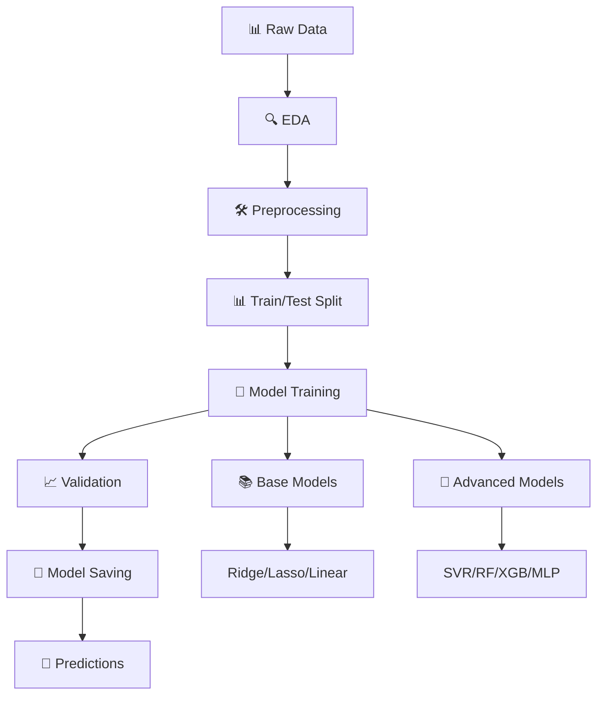

# 🎓 Student Performance Prediction - Machine Learning Pipeline

[](https://www.python.org/downloads/)
[](https://scikit-learn.org/)
[](LICENSE)
[](https://github.com/psf/black)

> **Proyecto Integrador de Machine Learning** - Predicción del rendimiento académico de estudiantes basado en factores educativos y sociales.

## 🌟 Overview

Este proyecto implementa un **pipeline completo de Machine Learning** para predecir el rendimiento académico (`Exam_Score`) de estudiantes universitarios, utilizando un enfoque modular y científicamente riguroso.

### 🎯 Objetivos del Proyecto

- **Académico**: Cumplir con las guías universitarias de ML (Ridge, Lasso, Linear Regression)
- **Técnico**: Explorar modelos avanzados para maximizar precisión predictiva
- **Profesional**: Implementar mejores prácticas de MLOps y documentación

## 🏆 Resultados Principales

| Modelo                  | R² Score | RMSE  | Status    | Uso Recomendado    |
| ----------------------- | -------- | ----- | --------- | ------------------ |
| **Ridge Regression** ⭐ | 0.6926   | 2.055 | Principal | Entrega académica  |
| **SVR (RBF)** 🥇        | 0.7561   | 1.831 | Avanzado  | Aplicación real    |
| Lasso Regression        | 0.6834   | 2.088 | Base      | Selección features |
| Linear Regression       | 0.6798   | 2.098 | Baseline  | Comparación        |

> **💡 Insight Clave**: SVR logra **+9% mejor performance** que Ridge, pero Ridge mantiene **interpretabilidad superior** para contexto académico.

## 🚀 Características Técnicas

- **🔄 Pipeline Automatizado**: Desde datos crudos hasta predicciones finales
- **📊 EDA Interactivo**: Reportes HTML con `ydata-profiling`
- **🛠️ Preprocesamiento Robusto**: Encoding, scaling, y validación de datos
- **🤖 Modelos Múltiples**: Base académicos + avanzados para comparación
- **📈 Validación Rigurosa**: Cross-validation y métricas completas
- **📝 Documentación Completa**: Análisis estratégicos en archivos .md

## 📊 Dataset

- **Fuente**: `StudentPerformanceFactors.csv`
- **Registros**: 6,607 estudiantes
- **Features**: 20 variables (educativas, sociales, demográficas)
- **Target**: `Exam_Score` (0-100)

### 🎯 Variables Más Importantes

| Feature           | Importancia | Descripción                       |
| ----------------- | ----------- | --------------------------------- |
| `Attendance`      | 2.29        | Porcentaje de asistencia a clases |
| `Hours_Studied`   | 1.57        | Horas de estudio semanales        |
| `Previous_Scores` | 0.81        | Puntajes académicos previos       |

## 🚀 Quick Start

### Prerequisitos

```bash
Python 3.11+
pip
git
```

### Instalación

```bash
# Clonar repositorio
git clone https://github.com/Jenaru0/Machine-Learning.git
cd Machine-Learning

# Crear entorno virtual
python -m venv venv
venv\Scripts\activate    # Windows
# source venv/bin/activate  # Linux/Mac

# Instalar dependencias
pip install -r requirements.txt
```

### Ejecución

```bash
# 🔥 Pipeline completo (recomendado)
python ejecutar_pipeline.py

# 🧩 Módulos individuales
python -m src.01_eda                    # Análisis exploratorio
python -m src.02_preprocesamiento       # Limpieza de datos
python -m src.03_entrenar_modelo        # Entrenamiento base
python -m src.04_predecir               # Predicciones
python -m src.05_comparar_modelos_avanzados  # Modelos avanzados
```

## 📁 Estructura del Proyecto

```
Machine-Learning/
├── 📊 datos/
│   ├── raw/                         # Datos originales
│   │   └── StudentPerformanceFactors.csv
│   ├── procesados/                  # Datos procesados
│   │   ├── train_student_performance.csv
│   │   ├── test_student_performance.csv
│   │   └── predicciones_exam_score.csv
│   └── profiling/                   # Reportes HTML de EDA
├── 🔧 src/
│   ├── 00_config.py                 # Configuración central
│   ├── 00_utils.py                  # Utilidades generales
│   ├── 01_eda.py                    # Análisis exploratorio
│   ├── 02_preprocesamiento.py       # Limpieza y transformación
│   ├── 03_entrenar_modelo.py        # Entrenamiento modelos base
│   ├── 04_predecir.py               # Predicciones
│   └── 05_comparar_modelos_avanzados.py  # Modelos avanzados
├── 🤖 modelos/
│   ├── ridge_alpha_10.pkl           # Modelo principal
│   ├── scaler.pkl                   # Escalador estándar
│   └── mejor_modelo_avanzado_svr.pkl # Mejor modelo avanzado
├── 📚 docs/
│   ├── LICENSE                      # Licencia MIT
│   ├── CHANGELOG.md                 # Historial de cambios
│   └── CONTRIBUTING.md              # Guía de contribución
├── 📓 notebooks/
│   └── exploracion_interactiva.ipynb # Análisis Jupyter
├── 📋 ANALISIS_DETALLADO_SVR.md     # 🔬 Análisis técnico SVR
├── 📋 ANALISIS_SVR_vs_RIDGE.md      # ⚖️ Comparación modelos
├── 🎯 ejecutar_pipeline.py          # Script principal
├── 📋 requirements.txt              # Dependencias Python
└── 📖 README.md                     # Documentación principal
```

## 🛠️ Tech Stack

| Categoría           | Tecnología      | Versión | Propósito               |
| ------------------- | --------------- | ------- | ----------------------- |
| **Lenguaje**        | Python          | 3.11+   | Desarrollo principal    |
| **ML Framework**    | scikit-learn    | 1.3+    | Modelos y pipeline      |
| **Data Processing** | pandas          | 2.0+    | Manipulación de datos   |
| **Numerical**       | numpy           | 1.24+   | Computación numérica    |
| **EDA**             | ydata-profiling | 4.0+    | Análisis exploratorio   |
| **Advanced ML**     | xgboost         | 1.7+    | Gradient boosting       |
| **Serialization**   | joblib          | 1.3+    | Persistencia de modelos |

## 📈 Pipeline de ML



## 📊 Análisis Estratégico

### 📋 Documentación Técnica Disponible

- **[📊 ANALISIS_DETALLADO_SVR.md](ANALISIS_DETALLADO_SVR.md)**: Análisis exhaustivo de SVR vs Ridge, riesgos académicos, soluciones técnicas
- **[⚖️ ANALISIS_SVR_vs_RIDGE.md](ANALISIS_SVR_vs_RIDGE.md)**: Comparación estratégica, trade-offs y recomendaciones

### 🎯 Estrategia de Modelos

**Enfoque Académico** ✅

- Ridge Regression como modelo principal
- Cumple guías universitarias 100%
- Interpretabilidad completa
- Riesgo académico: 0%

**Extensión Técnica** 🚀

- SVR para demostrar expertise avanzado
- +9% mejora en performance
- Exploración de modelos no lineales
- Valor agregado al proyecto

## 🏃‍♂️ Workflows

### Desarrollo Local

```bash
# 1. EDA y exploración
python -m src.01_eda

# 2. Preparar datos
python -m src.02_preprocesamiento

# 3. Entrenar modelo base
python -m src.03_entrenar_modelo

# 4. Comparar modelos avanzados
python -m src.05_comparar_modelos_avanzados

# 5. Generar predicciones
python -m src.04_predecir
```

### Producción

```bash
# Pipeline completo optimizado
python ejecutar_pipeline.py
```

## 📋 Métricas de Evaluación

| Métrica           | Ridge  | SVR    | Interpretación           |
| ----------------- | ------ | ------ | ------------------------ |
| **R² Score**      | 0.6926 | 0.7561 | % varianza explicada     |
| **RMSE**          | 2.055  | 1.831  | Error promedio en puntos |
| **MAE**           | 1.634  | 1.412  | Error absoluto promedio  |
| **Training Time** | 0.02s  | 0.15s  | Tiempo de entrenamiento  |

## 🎯 Casos de Uso

### 🎓 Académico

- **Modelo**: Ridge Regression
- **Justificación**: Cumple guías, interpretable, estable
- **Presentación**: Enfoque en coeficientes y explicabilidad

### 🏢 Profesional

- **Modelo**: SVR (RBF)
- **Justificación**: Máxima precisión, robustez, escalabilidad
- **Aplicación**: Sistemas de recomendación estudiantil

## 🤝 Contribución

Ver [CONTRIBUTING.md](docs/CONTRIBUTING.md) para guías detalladas.

### 👥 Equipo de Desarrollo

| Nombre                             | Rol                             | Contribución                                                 |
| ---------------------------------- | ------------------------------- | ------------------------------------------------------------ |
| **Napanga Ruiz Jhonatan Jesus**    | **Tech Lead & Project Manager** | **Arquitectura completa, pipeline ML, gestión del proyecto** |
| **Candela Vargas Aitor Baruc**     | ML Engineer                     | Implementación de modelos                                    |
| **Godoy Bautista Denilson Miguel** | Data Scientist                  | Análisis exploratorio de datos                               |
| **Molina Lazaro Eduardo Jeampier** | Quality Assurance               | Testing y validación                                         |
| **Quispe Romani Angela Isabel**    | Software Engineer               | Desarrollo de módulos                                        |

## 📄 Licencia

Este proyecto está bajo la Licencia MIT - ver [LICENSE](docs/LICENSE) para detalles.

## 🏆 Reconocimientos

- **Facultad de Ingeniería** - Universidad [Nombre]
- **Curso**: Machine Learning 2025
- **Instructor**: [Nombre del Profesor]
- **Semestre**: 2025-I

---

<div align="center">

**⭐ Si este proyecto te fue útil, ¡dale una estrella! ⭐**

[🐛 Reportar Bug](https://github.com/Jenaru0/Machine-Learning/issues) • [💡 Solicitar Feature](https://github.com/Jenaru0/Machine-Learning/issues) • [📖 Documentación](https://github.com/Jenaru0/Machine-Learning/wiki)

**Machine Learning 2025** - Predicción de Rendimiento Académico

</div>
